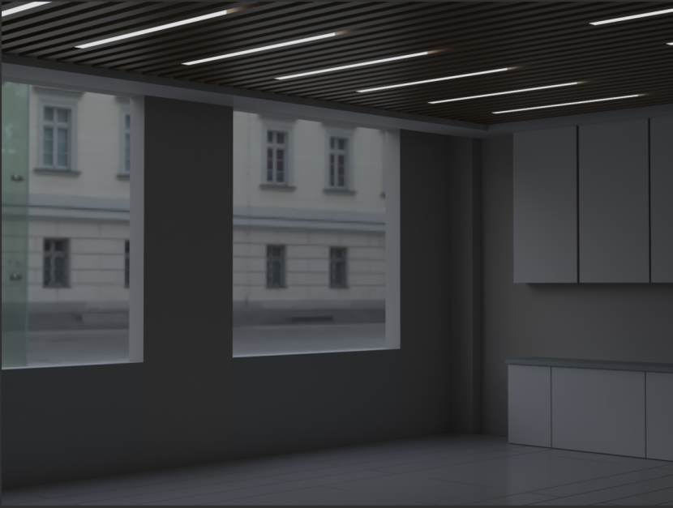

# HDRI 环境搭建

- 如何使用环境贴图——快速搭建一个环境包含了打光，背景设计，还有视觉纵深。
  在动画的制作过程中，总会有环境搭建这一部分，例如：做一个小型工业器械的工作流程动画，需要搭建一个工厂的环境；做一房间设计图，需要在屋外搭建环境，让窗户外的光和环境自然的打进来。

不同的 HDRI 的贴图其实可以携带不同的环境光，有些贴图它自带环境光较强，因此不需要我们自己在添加其他效果光照，之际额使用即可。
在 max 中使用贴图直接如以下步骤即可：

按 8 打开环境与效果窗口，环境贴图选择位图（vray），将 hrdi 拖到位图上。

将该贴图上给一个新的材质球，贴图类型选择球形，在视图-视口配置-背景-使用环境背景，可以让背景表现为 hdri 图，若是贴图的光或者视图的视角不合适，可以水平旋转调整到合适的位置，但是垂直旋转就尽量不要用，垂直方向上大部分都是设计好的，环境贴图的光可以通过全局倍增来调整大小。

# 案例一

当不添加环境贴图时，环境光会因为外界没有相应的贴图而过曝，使整个效果表现不理想。

当添加环境贴图后，窗外的画面会更加自然，打光也恰好。如果需要我们进行更加详细的调节我们就可以直接提高全局倍增。

在 vary 的插件中我们可以直接打开穹顶光，提高亮度，在 vary 中还可以直接更改不同的灯光设置，如下图

# 案例二

小型工业机械可以搭建在工厂和实验室的场景中，但是场景搭建耗时耗力，搭建一个简单的又显的太敷衍，而且效果也比较一般，如下：

使用一个工厂环境的 hdri 贴图，会使该机械的显示更加合理，不会突兀，而且环境光也更加贴近现实，对其使用环境也更贴近。

# 总结

使用环境贴图可以达到事半功倍的效果，比自己搭建场景更加合适，省去了场景的打光、贴图、建模和上材质的过程，不过 hdri 一般是从网页上寻找下载的，对于比较苛刻的场景没有就可能需要自己建模，而且环境贴图也并非全都合适，总之，环境贴图更加省力省时，但是若没有合适的，仍需要要自己搭建场景。
