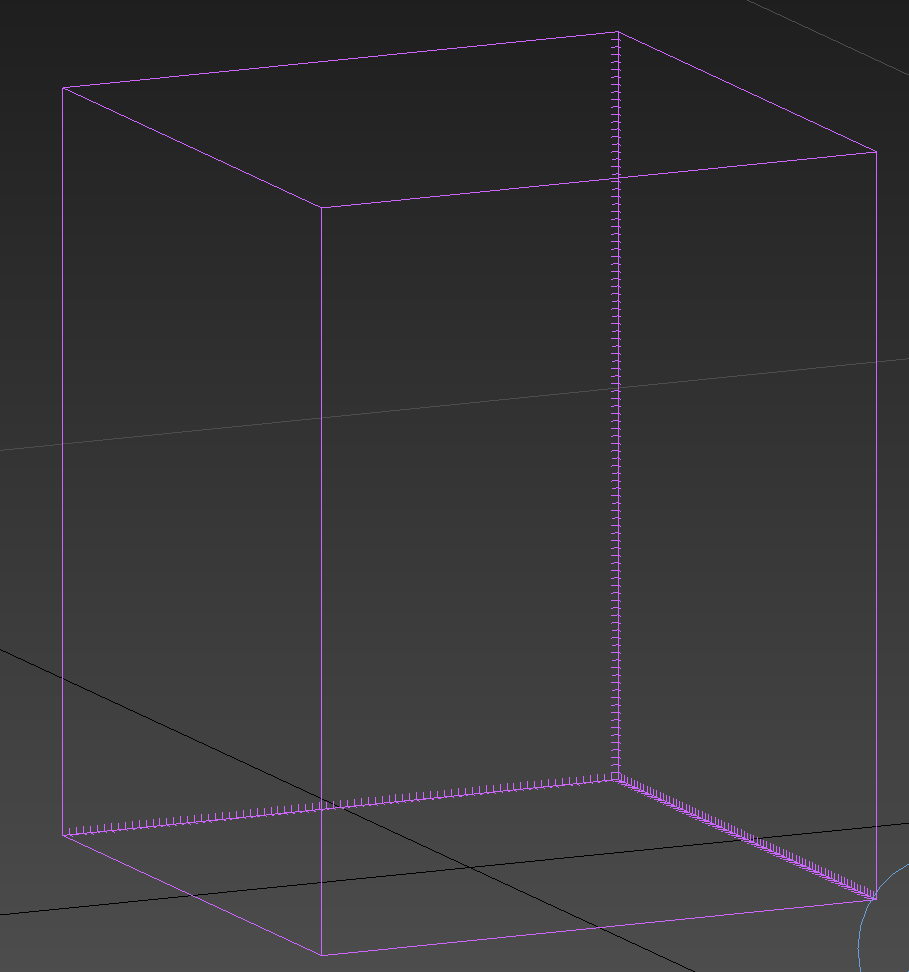
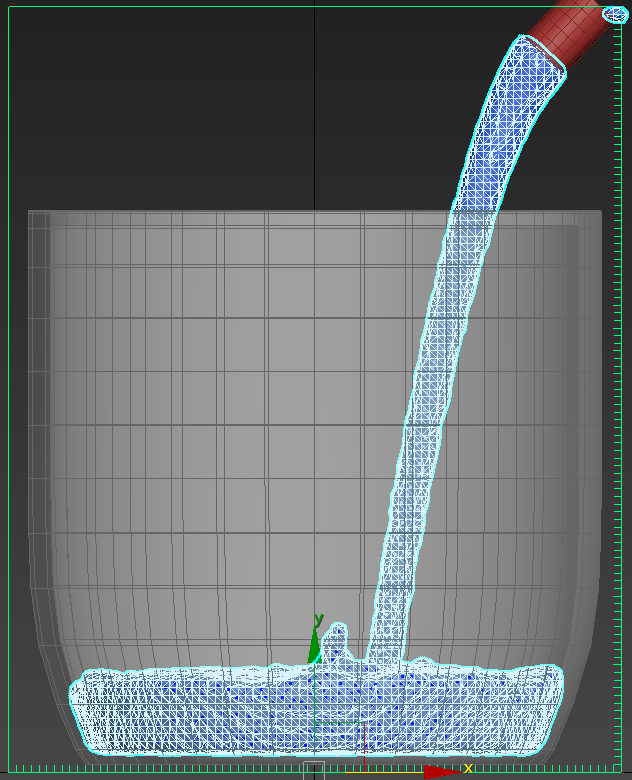
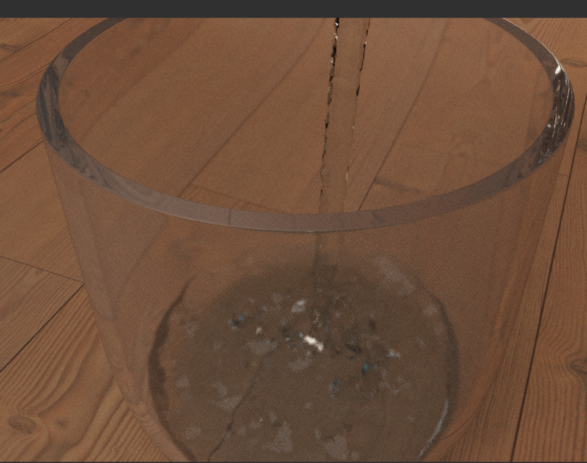
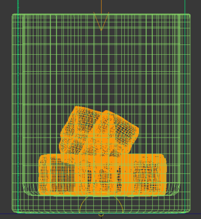
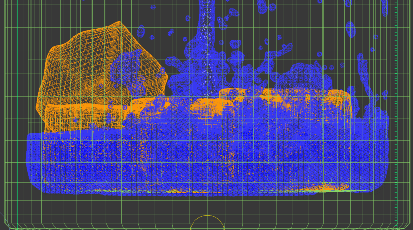
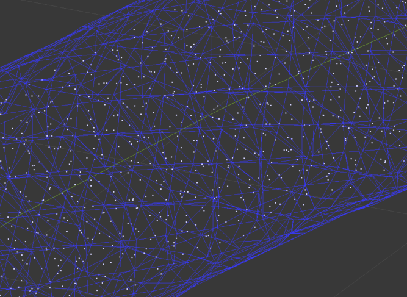
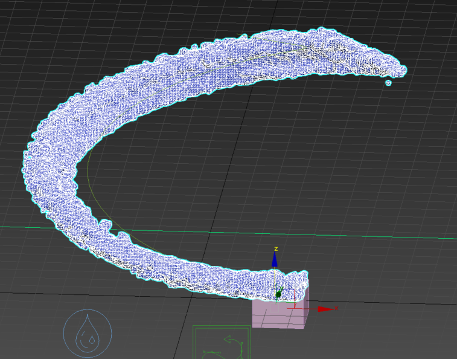

# 3DMAX 液体模拟该怎么办？

我在记录该学习记录时，已经使用流体模拟大概一年半，经过一年半的见识，流体模拟并非每个有这个部分的项目都需要进行模拟，这样反而会降低制作效率，因此推荐以下场景可以进行模拟

1. 硬件支持
   - 首先我并不直接说明配置细节，因为我也对这部分不是很了解，但是如果你使用的配置不算很老的话，一般是没有问题的
     不过我还是要提醒一句，首先液体模拟的基本原理是基于物理模拟的粒子，数量很多，因此细节越多，所需的配置也越高！
2. 场景中需要有液体
   - 场景内有液体部分，这个液体是非常泛泛的概念，水，油，雾，奶油等等，都可以之需要调节对应的参数即可
3. 场景液体部分较为单一
   - 什么叫单一呢？我们举个例子场景内一杯水向另一个杯子倒水，这就是一个小场景，在比如你可以模拟一段水面的模拟，海面的模拟，加上一些碰撞体，就可以模拟出一个场景，这才叫相对单一
     如果你需要的场景是大型的，非单个范围的液体模拟，那我就不建议使用液体模拟，这不现实，通常的做法是在需要模拟的附近大概一个范围进行模拟，然后再最后进行不同层级的优化，这部分不做详细记录，只做提示！

- 液体模拟我们来分析一下只有两种情况，有源液体模拟和无源液体模拟，因为无论如何我们模拟的目标是水，他要么通过有源不断进入场景，要么在模拟前就已经处在场景中。

## 有源液体模拟

**模拟空间**：

- 模拟空间是指模拟的范围，一般是一个立方体，在这个立方体内进行模拟，一般是场景的大小，或者是场景的大小的一个范围
  需要有对对应的单位设置，一般是米，或者是厘米，或者是英寸，根据场景的大小进行设置，请勿过大，否则会导致模拟速度缓慢，甚至卡顿

模拟空间有一个重要属性分辨率，分辨率是指模拟空间的每个单位的大小，一般是一个小方块，这个小方块的大小就是分辨率，一般是 0.1，0.2，0.3 等等，根据场景的大小进行设置，请勿过大，否则会导致模拟速度缓慢，甚至卡顿。
当然也需要设置模拟空间的容器墙，来控制模拟空间的具体范围，比如需要液体在有边界的情况下进行模拟，只想让他在 z 轴上摸模拟，或者其他情况。

**发射器**

- 发射器是指模拟的液体的来源，一般是一个点，或者是一个区域，根据场景的需要进行设置，一般是通过模型的 ID 进行设置。

发射器也有一个重要属性就是他的初始速度，初始速度会决定液体在一定时间内处在模拟空间内的液体体积，还会决定液体出发后与碰撞体的碰撞情况，初始速度越高，那么碰撞的样式就愈发激烈。

**碰撞体**

- 碰撞体是指模拟的液体的碰撞体，也是液体的模拟对象，因为无论是一个静态的碰撞体还是动态的碰撞体，都会有物理模拟，静态模拟的给更加快捷，动态则需要设计不同的被碰撞物体的物理模拟

碰撞体的的重要属性是他的物理属性，比如他的密度，重量，摩擦力等，这是决定他与液体模拟的模拟效果，不同的物理属性会导致不同的模拟效果，因此需要根据场景的需要进行设置。

**设置以及优化**

这个部分是一个非常选哟啊耐心的部分，我们基本上不可能依次就可以把所有的参数一次性的设置成功，我们总得通过自己的上一次设置来判断我们的修正方向

1. 每帧步数
   - 每帧步数是指每帧模拟的时间，在我们经常使用的例子模拟中都会遇到他的身影，由于我们对物理模拟的过程也就是通过我们的细分实践判断下一步粒子处在什么位置，应该和其他例子有什么样的交互，可是如果我们直接保持默认 1 step per frame，你将会看到无论是例子模拟还是液体模拟会出现非常明显的断层现象
2. 密度设置
   - 有了液体或者是气体，需要对他的密度进行设置，水相比油的密度更轻，但是如果液体是奶油，那么还有一些属性是粘度，这个属性会决定液体的流动性， viscosity。

## 无源液体模拟

**模拟空间**

- 这个部分便舍弃了发射器的部分，会在模拟时就设置好初始状态下液体占模拟空间的比例。

**碰撞体**

- 碰撞体与有源的液体模拟基本一致，但是会有些特殊设置，因为有些物体可能搬来就在液体中，初始状态下就和液体就有接触。

# 案例一

有源水杯案例：按照思路首先是模拟空间

如果没有很多经验可以把 grid 中的细分调整的更加稀疏一点，如果你完全能够想象到模拟后大概是什么样子，那你可以直接把网格细分开的更加密集一点，一定要注意单位！

但后就是发射源，这里我不推荐你直接使用一个圆柱当作发射源，我们得明白一个道理，如果仅仅使用几个面，几个平面作为水源的发射源，虽说方向是很好控制了，但是有个问题，由于发射源的平面过于
整齐会导致，模拟时进一步加重他的每帧步数带来的影响，你将会看到一个更加明显的断层现象，我们来展示一下什么是断层如下图

这个就叫做断层，还记得之前讲过的，流体模拟实际是依赖于我们模型环境下每帧的运算密集程度，这个，可能在之后的记录中会将讲解到例子模拟，它的检测碰撞更加依赖于我所说的每帧步数，你可以想象一下，如果一个粒子上一帧还在被检测物体上方，下一帧便在检测物体的下方，那还谈论什么检测，他只会“穿墙而过”因此可以调高我们的这个值，达到一下效果

- 调节的数据一般以 2 的倍数进行调整，我在其它的记录中也会提及

怎么样这样是不是就更加的顺畅了，也可以调整 time 比例，默认粘度，表面张力，等等。不过我们得审视一下之前的问题，它如果发射源是一个平面，那么他的发射源就会是一个平面，因此会导致之前的问题，那么我们该怎么办呢？更好的方法就是更换发射源，更换为“球体”或者不规则表面。我们来看一下效果如何：

效果还是不错的，但是差一点东西。这些得靠自己的审美以及检验来判断了，比如水看起来流动性不太强，为啥没有水花，甚至可以添加气泡，这都是可以的。

# 案例二

- 有源碰撞案例，除此之外其实我们还有其他情况，就是模拟空间内其他的物体，比如一些饮品内的吸管，冰块，或者雪糕上的小的装饰物，这些都是碰撞体。

来看看如何处理首先需要有对应的物体被生成为物理物体，这个在之前的记录中已经提到过了，这里就不再赘述了。

如图我们已经进行了最基础的准备，下一步我们进行模拟就可以了，效果是这样的。

这样就可以让其他物体于液体互动的部分实现了使用插件 tf。注意 tf 中的流体设置进行一些调整，最后可以调整为如上效果

# 案例三

- 无源案例，无源流体有两种方式进行模拟，如果你的场景中仅有流体，那么我不建议整个场景中都进行液体模拟，可以使用贴图的样式进行模拟，至于如何模拟，记录一下贴图。

图例中使用了火凤凰的贴图，其中一个为火凤凰的海洋贴图，贴图是动态贴图，因此我们需要使用 vary 的 VRayDisplacementMod 贴图进行模拟，我们通过给予其火凤凰的 ocean 的贴图，这样的话就可以联动其动态的变化。

之后通过盖顶两层元素，上层元素就是透明材质，下层元素则以火凤凰的 ocean 贴图为底制作对摇滚的泡沫贴图，就可以制作这样的海洋场景

如下图

请注意该场景是自带动画的，并不需要执行 K 帧动画。

# 案例四

- 无源液体设计过程

我们来设计一个很简单的过程，我们在一个场景中需要让水流带有导向性的围绕一个物体进行流动，
虽说这个过程需要一开始就出现液体及性能模拟，另外还需要一个其他物体如图所示

可以看到我们需要一个来自 FD 的 path flow，来实现水流的导向性

这样我们就可以看到对应的效果了，当然我们还是需要更改对应的参数来让水流更加的顺畅

# 总结

好了现在这部分的基础我们也已经清楚了，但是还有一些东西我们没有说明，比如 tyflow 部分，那也是非常重要的粒子模拟部分，可以和液体模拟相互交互，通过不同的设置操作达到不同的效果，比如我们可以在液体中添加一些粒子，来实现液体和粒子的相互作用，比如我们可以在液体中添加一些粒子，来实现液体和粒子的相互作用，比如我们可以在液体中添加一些粒子，来实现液体和粒子的相互作用。

这个的话我们就系一篇记录再说啦！
