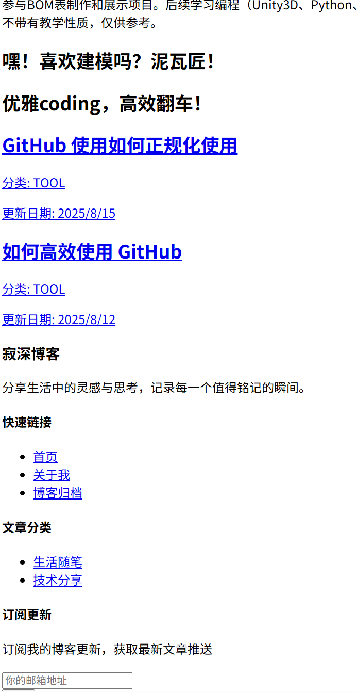
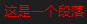
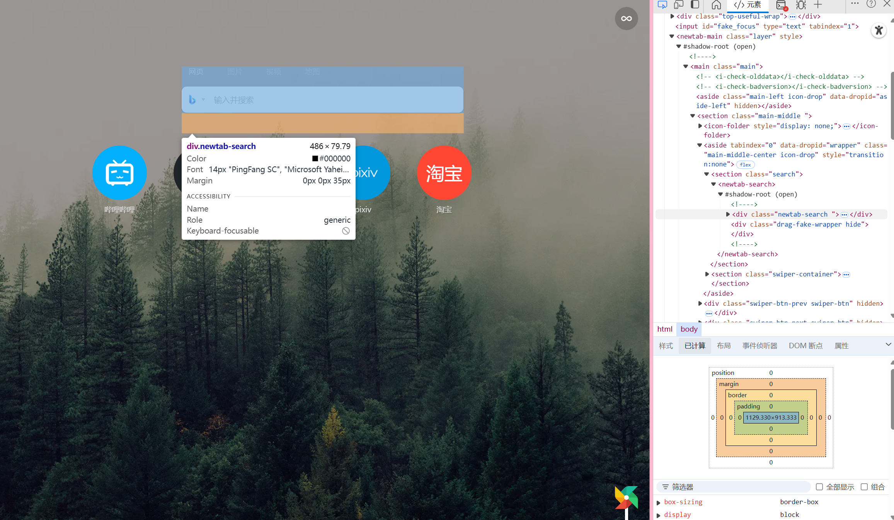

# 常规 css 样式

**在阅读本片文档之前请熟知，你不能靠本篇文章就完全明白如何使用和明白各各属性和其值，你必须通过自己的实践配合来不断提升自己的经验，才能更好的掌握 css 样式。**

之前我们已经大概了解了 HTML 这种标签语言，但是当我们直接书写网页时往往会看到以下情况：

```html
<head>
  <style>
    p {
      color: blue;
      font-size: 16px;
    }
  </style>
</head>
<body>
  <p>这是一个段落</p>
</body>
```

结果如下：

    这是一个段落

这明显不是我们想要的效果，他只能是一个段落，没有装饰，想一想是否真的在哪里见过这样的网页呢？在我们浏览网页时偶尔会出现这样的问题，如下图：



没有任何样式，可阅读性差。那么我们该如何解决这个问题呢？

## 了解 CSS 样式

css 是一种用于美化 HTML 和 XML 文档的样式表语言。他能控制网页的布局、字体、颜色、背景、视觉效果。纯 CSS 指代的是使用原生的 CSS 特性，不依赖第三方框架和预处理器！

废话不多说，我们来介绍一下把一段标记性语言添加样式的方法。

### 内联样式

这种方法指代的是直接把样式写在标签内部，例如：

```html
<p style="color: red; font-size: 16px;">这是一个段落</p>
```

我们就可以看到如下效果：

<p style="color: red; font-size: 16px;">这是一个段落</p>

这样的话我们就已经使用了一些 css 样式，但是内联样式的问题是他只能作用于当前的标签，不能作用于其他的标签，所以我们一般不使用内联样式。也不建议使用，因为代码难以维护

### 内部样式表

```html
<head>
  <style>
    p {
      color: red;
      font-size: 16px;
    }
  </style>
</head>
<body>
  <p>这是一个段落</p>
</body>
```

效果如下



可以看到我们在 head 的标签内开启了一个 style 的标签，这个标签内的内容就是 css 的样式，我们可以在这个标签内书写 css 的样式，这样的话我们就可以把 css 的样式作用于所有的 p 标签。请注意是所有的 P 标签内的文字都被作用了。

### 外部样式表

外部样式表是指把 css 的样式写在一个外部的文件中，然后在 html 中引用这个文件。例如：

```html
<head>
  <link rel="stylesheet" href="style.css" />
</head>
<body>
  <p>这是一个段落</p>
</body>
```

我们可以在 style.css 中书写 css 的样式，例如：

```css
p {
  color: red;
  font-size: 16px;
}
```

效果如下


可以看到我们成功的把 css 的样式作用于了 p 标签。这种方式是我们最常用的方式，也是最推荐的方式。因为易于维护和复用，什么是复用呢？

**复用**指的是我们可以在多个 html 文件中引用同一个 css 文件，这样的话我们就可以在多个 html 文件中使用同一个 css 文件的样式，而不需要在每个 html 文件中都书写一遍 css 样式。

## 常用 CSS 语法

CSS 规则通常由选择器和声明块组成。选择器指定要应用样式的元素，声明块包含一个或多个声明，每个声明由属性和值组成。

```css
selector {
  property: value;
  property: value;
  ...;
}
```

进行解释

**选择器**：选择器指定要应用样式的元素。

**声明块**：声明块包含一个或多个声明，每个声明由属性和值组成。其实就是`{}`内的内容

**属性**：属性指定要应用的样式的名称。

**值**：值指定属性的具体样式。

### 选择器

- 标签选择器：p, div, h1
- 类选择器：.classname
- ID 选择器：#idname 你可以在标签内定制 id 例如`<div id="idname">`
- 通用选择器：\*（选择所有元素）
- 后代选择器：div p（选择 div 内的所有 p）
- 子选择器：div > p（选择 div 的直接子元素 p）
- 伪类选择器：:hover, :active, :first-child

  - 什么是伪类选择器？
    伪类选择器是指在选择器的基础上添加一些特殊的状态或行为，用于选择满足特定条件的元素。
    :hover 鼠标悬停在元素上时触发
    :active 元素被激活时触发
    :first-child 选择元素的第一个子元素

- 伪元素选择器：::before, ::after
  - 什么是伪元素选择器？
    伪元素选择器是指在选择器的基础上添加一些特殊的状态或行为，用于选择满足特定条件的元素。
    ::before 选择元素的第一个子元素
    ::after 选择元素的最后一个子元素

```css
/_ 类选择器 _/ .intro {
  font-weight: bold;
}

/_ ID 选择器 _/ #unique {
  background-color: yellow;
}

/_ 伪类选择器 _/ a:hover {
  color: green;
}

/_ 伪元素选择器 _/ p::first-line {
  color: blue;
}
```

### 核心属性

1.  文本与字体

    `color`：文本颜色 #FF0000、red、rgb(255, 0, 0)

    `font-size`：字体大小（如 16px、1rem、2em）

    `font-family`：字体（如"Arial", sans-serif）

    `font-weight`：字体粗细（如 normal、bold、700）

    `text-align`：文本对齐（left、center、right、justify）

    `line-height`：行高（如 1.5、20px）

    `text-decoration`：文本装饰（如 underline、none）

2.  盒模型
    CSS 盒模型是布局的基础，包括：

    内容（`Content`）：元素的内容区域（宽高由 width 和 height 控制）

    内边距（`Padding`）：内容与边框之间的空间

    边框（`Border`）：围绕内边距的线

    外边距（`Margin`）：边框外的空间

    这太不好理解了，但是好在浏览器已经为我们解释了，我们可以在浏览器中查看元素的盒模型，例如：

    
    可以看到浏览器其实内置了这些调整功能以供我们进行调试。

    相关属性：

    `width`、`height`：内容区域的宽高

    `padding`：内边距（如 padding: 10px;）

    `border`：边框（如 border: 1px solid black;）

    `margin`：外边距（如 margin: 20px;）

    `box-sizing`：控制盒模型计算方式（默认 content-box，推荐 border-box）

3.  背景

    `background-color`：背景颜色

    `background-image`：背景图片（如 url('image.jpg')）

    `background-position`：背景定位

    `background-repeat`：背景重复（repeat、no-repeat、repeat-x）

    `background-size`：背景大小（如 cover、contain）

4.  定位与布局
    CSS 定位控制元素在页面中的位置：

    position：

    - 相关属性：

      `static`：默认定位

      `relative`：相对于自身位置偏移

      `absolute`：相对于最近的定位祖先元素

      `fixed`：相对于视口固定

      `sticky`：混合 relative 和 fixed

    `top`、`right`、`bottom`、`left`：偏移量

    `z-index`：控制叠放顺序

5.  显示与浮动 (这里的内容已经不是很常用了！)

    display：

    - 控制元素显示方式

      `block`：独占一行（如 div、p）

      `inline`：不换行（如 span、a）

      `inline-block`：行内块元素

      `none`：隐藏元素

    `float`：元素浮动（left、right）

    `clear`：清除浮动（left、right、both）

6.  现代 CSS 布局技术

    Flexbox（弹性盒布局）是一种一维布局模型，适合排列行或列。
    **基本概念：**

    `Flex` 容器：设置 display: flex;的元素
    `Flex` 项：容器的直接子元素

    **常用属性**：

    容器：

    `flex-direction`：排列方向（row、column）

    `justify-content`：主轴对齐（flex-start、center、space-between）

    `align-items`：交叉轴对齐（stretch、center、flex-end）

    Flex 项：

    `flex`：定义弹性比例（如 flex: 1）

    `flex-grow`：增长比例

    `flex-shrink`：收缩比例

    `flex-basis`：基础大小

```css
.container {
  display: flex;
  flex-direction: row;
  justify-content: space-between;
  align-items: center;
}
.item {
  flex: 1;
  margin: 10px;
}
```

7.  Grid

    CSS Grid 是一个二维布局系统，适合复杂网格布局。
    **基本概念：**

    `Grid` 容器：设置 display: grid;的元素

    `Grid` 项：容器的直接子元素

    **常用属性：**

    容器：

    `grid-template-columns`：定义列宽

    `grid-template-rows`：定义行高

    `gap`：网格间距

    `justify-content`、`align-content`：网格整体对齐

    Grid 项：

    `grid-column`：指定列范围
    `grid-row`：指定行范围

    示例：

```css
css.grid-container {
display: grid;
grid-template-columns: repeat(3, 1fr);
gap: 10px;
}
.grid-item {
grid-column: span 2; /_ 跨两列 _/
}
```

### 动画与过渡

1. 过渡（Transition）

用于平滑改变 CSS 属性值：

`transition-property`：过渡的属性

`transition-duration`：持续时间

`transition-timing-function`：缓动函数（如 ease、linear）

`transition-delay`：延迟时间

示例：

```css
cssbutton {
  background-color: blue;
  transition: background-color 0.3s ease;
}
button:hover {
  background-color: green;
}
```

2. 动画（Animation）

通过@keyframes
定义动画序列：

`animation-name`：动画名称

`animation-duration`：持续时间

`animation-iteration-count`：循环次数（如 infinite）

示例：

```css
@keyframes slide {
  0% {
    transform: translateX(0);
  }
  100% {
    transform: translateX(100px);
  }
}
.element {
  animation: slide 2s infinite;
}
```

### 响应式设计

响应式设计让网页适配不同设备。
相对单位

`vw、vh`：视口宽高的百分比

`rem`：根字体大小的倍数

`em`：父元素字体大小的倍数

`%`：父元素尺寸的百分比

1. 媒体查询

根据设备特性应用不同样式：

```css
@media (max-width: 600px) {
  body {
    font-size: 14px;
  }
  .container {
    flex-direction: column;
  }
}
```

2. 响应式图片

使用 `max-width`: 100%确保图片自适应

使用 `srcset` 和 `sizes` 加载不同分辨率图片：

```html

```

### 高级 CSS 技术

1. 伪类与伪元素

伪类：如:`hover`、:`nth-child(n)`、:`focus`

伪元素：如`::before`、`::after`

示例：

```css
cssdiv::before {
  content: "★";
  color: gold;
}
```

2. 变量（CSS Custom Properties）

   使用自定义属性存储值：

```css
:root {
  --primary-color: #007bff;
}
button {
  background-color: var(--primary-color);
}
```

3. 滤镜与变换

滤镜（filter）：如 blur(5px)、grayscale(50%)

变换（transform）：如 rotate(45deg)、scale(1.2)

示例：

```css
img {
  filter: sepia(100%);
  transform: rotate(10deg);
}
```

# 最后

相信能看完这篇文档的人，一定很有耐心，但是在这里你不能学到所有东西，太多的属性，太多的值，不可能全部进行展示，你也要依照自己的设计理念不断变化他们的组合来完成自己的网页设计

在这里对应的官网来学习更多的知识
MDN Web Docs：CSS 参考文档（https://developer.mozilla.org）
