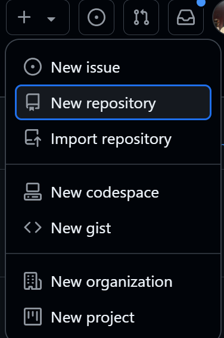
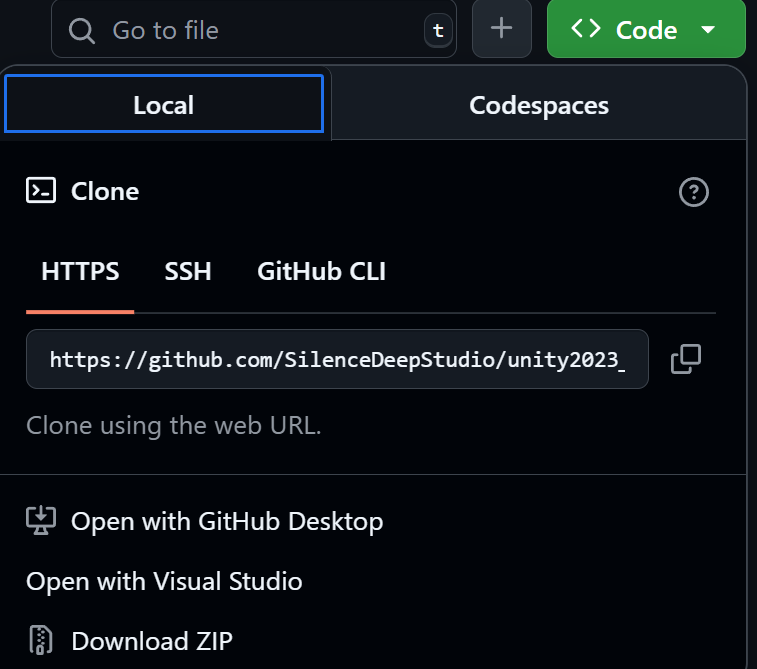

# 如何高效使用 GitHub

## 第一步：创建 GitHub 账号

GitHub 的官网地址： https://github.com/
在注册账号时会出现两个人信息名称，首先是 Name，可以随便填写，其次是 username，这个是 GitHub 的唯一标识，不能重复，所以需要注意不要使用过于常见的名字。


图片中较大字号为名字，较小字号的为用户名。

- 要注意的是这两个均可更改，在个人账户中
- 修改名字在主页面点击头像，点击 Settings，然后点击 Profile。
- 修改用户名需要联系 GitHub 支持，需要提供原用户名和新用户名，GitHub 会发送邮件到原邮箱，要求验证新邮箱。
  - 修改位置在主页面点击头像，点击 Accout，然后点击 Change username。

## 第二步：创建仓库

首先最简单的创建方式是从头开始创建一个仓库，点击右上角的 **+** 号，然后选择 **New repository**。



创建完成后即可在自己的 GitHub 主页看到刚刚创建的仓库。

## 第三步：上传代码

上传代码有两种方式：

1. 上传本地代码：点击仓库主页上的 Code 按钮，然后点击上传文件，选择本地代码文件，点击 Commit changes 按钮。
2. 上传 GitHub 仓库：点击仓库主页上的 Code 按钮，然后点击复制按钮，然后在本地仓库中使用 git 命令克隆仓库。

## 第四步：创建分支

分支是 Git 版本控制系统中重要的概念，可以帮助开发者开发新功能或修复 bug，而不会影响主分支代码。但是每个仓库在建立之初就会有一个 main 分支他是默认分支无法删除。

- 创建分支：点击仓库主页上的 Branch: master，然后输入分支名称，点击 Create branch: 输入分支名称。
- 切换分支：点击仓库主页上的 Branch: master，然后点击右侧的箭头切换分支。

### 下载代码

下载代码有两种方式：

1. 下载本地代码：点击仓库主页上的 Code 按钮，然后点击 Download ZIP 按钮，下载压缩包。
2. 下载 GitHub 仓库：点击仓库主页上的 Code 按钮，然后点击复制按钮，然后在本地仓库中使用 git 命令克隆仓库。

- 这和上传代码是不是有些相似？其实到此为止已经可以开始使用 GitHub 了，但是还有很多其他的功能需要了解，比如：
- 管理 Issue：可以用来记录 bug、需求、任务等。
- 管理 Project：可以用来管理项目，包括任务、进度、里程碑等。
- 管理 Wiki：可以用来记录文档。
- 管理 Pull Request：可以用来向仓库提交代码，需要先 fork 仓库，然后在 fork 的仓库中提交 PR。
- 管理 Pages：可以用来托管静态网站。
- 管理 Actions：可以用来自动化流程。
- 管理 Settings：可以用来管理仓库设置。
- 管理 Security：可以用来管理安全漏洞。
- 管理 Packages：可以用来管理依赖包。
- 管理 Marketplace：可以用来购买第三方应用。
- 管理 Organizations：可以用来管理组织。
- 管理 Members：可以用来管理组织成员。
- 管理 Teams：可以用来管理团队。
- 管理 Billing：可以用来管理付费。
- 管理 Webhooks：可以用来设置 Webhook。

## 第五步：本地 Git 配置

- 下载 Git：https://git-scm.com/downloads
  首先我要解释一下为什么要下载 Git，因为 GitHub 是基于 Git 的，所以我们需要安装 Git 才能使用 GitHub。另外我们在使用 GitHub 时总需要进入网页进行操作固然非常麻烦，所以我们不如把正在建立的项目首先连接到本地，只需要在本地编辑然后完成后按时提交到云端就可以啦！（在网页上传有文件大小限制，而在本地编辑可以无限扩充）
- 配置 Git：
  在下载 Git 我们一定要主要选择把它的全局右键添加进我们的环境变量，这样我们就可以在任意目录下打开命令行，输入 git 命令来进行操作。
- 然后我们需要配置一下 Git 的用户名和邮箱，输入以下命令：
  先进入我们想要把项目放置的本地文件内，右键打开 git bash，输入以下命令：

```bash
git config --global user.name "your username" #输入自己的用户名
git config --global user.email "your email" #输入自己的注册邮箱
```

这是来干嘛呢？是用来配置 Git 的全局（global）用户名和邮箱，这样我们在本地提交代码时，就会显示出我们自己的用户名和邮箱。全局状态就可以不用每次转化一个项目就要重新输入依次我们的用户名和邮箱了。

- 克隆仓库：
  我们已经配置好了 Git，接下来就可以克隆仓库了，在 GitHub 网页上找到我们想要克隆的仓库，点击右上角的 Code 按钮，然后点击复制按钮，然后在本地仓库中打开 git bash，输入以下命令：

```bash
git clone #复制的链接
```

这时候我们就把 GitHub 上的仓库克隆到本地了，我们就可以在本地进行编辑，然后提交到 GitHub 上。（所以一定要首先在网页新建一个仓库，然后把链接复制到本地，然后克隆到本地！这个顺序非常重要！）

- 拉取仓库：
  我们在操作项目的时候往往会遇到是别人已经提交了代码，我们需要把别人的代码拉取到本地，但是在此之前一定要选好你要把这个项目放在本地的那个文件夹内，然后在这个文件夹内打开 bash，输入以下命令：gti init，然后输入以下命令：

```bash
git init #初始化仓库
```

这时候我们就把本地仓库初始化了，然后我们就可以把别人的代码拉取到本地了，这个时候我们其实看不到文件夹有什么变化但是当我们打开隐藏文件时就会看到一个.git 的文件这就说明我们在这个文件夹内已经初始化了仓库。
那我们怎么指定这个本地文件夹与哪个云端仓库进行关联呢？我们需要在本地仓库中输入以下命令：

```bash
git remote add origin <远程仓库链接> #复制的链接
```

这个链接在哪里呢？如图每个仓库都有一个链接。



这之后如果不放心怎么办？我们可以通过查看关联仓库的指令来查看关联的仓库：

```bash
git remote -v
```

当显示了
origin https://github.com/用户名/仓库名.git (fetch)
origin https://github.com/用户名/仓库名.git (push)
就说明成功了（芜湖~）。至于为什么有两个是因为一个是 fetch，一个是 push，我们只需要 push 到云端就可以了。那么到此我们就把本地仓库的所有配置完成啦！

这时候我们就需要用到 git pull 命令了，在 git bash 中输入以下命令：

```bash
git pull origin main #后面的main是你要拉取的分支名，
```

一定要记得首次拉取仓库一定要指定仓库分支！不过拉取一次之后就可以使用 pull 来拉取了，因为他已经记住了拉取的分支哦！

```bash
/d/DES/SD_Studio (main) #括号的main就是你现在所在的分支名
```

这个代码就在 bash 页面内。之后就可以在 main 分支里操作了，本地编辑更改，本地查看审查。

## 第六步：提交代码

- 我们在本地编辑完成后，需要提交到云端，在 git bash 中输入以下命令：

```bash
git add . #添加所有文件
git commit -m "提交信息" #提交信息
git push origin main #提交到云端
```

1. git add . ：把所有文件添加到暂存区。当然"."的意思是全部文件上传，当然也可以指定文件名。
2. git commit -m "提交信息" ：把暂存区的文件提交到本地仓库。
3. git push origin main ：把本地仓库的 main 分支提交到云端仓库的 main 分支。
   注意一定要在首次 git push <分支>！之后就可以直接键入

```bash
git push
```

这一步虽然很简洁但是蕴含一个逻辑那就是我们本地更改后 git 会审视我们在本地的仓库里都更改了什么，然后我们把这些更改先添加到缓存区也就是 add 命令，当然缓存不是已经上传了，我们在上传之前一定需要一个 commit 命令来提交我们本地的更改 -m "提交信息"也可以在云端仓库指明我们这次提交更改了什么这就需要程序员自行编写提交信息了，然后我们再把缓存区的文件 push 到云端仓库，这样云端仓库就和本地仓库同步了。

# 其他问题 Git bash 命令

- 我想创建新分支，但是我不知道我现在在哪个分支，怎么创建？

  查看当前分支：

  ```bash
  git branch
  ```

  创建新分支（如 dev）：

  ```bash
  git branch dev
  ```

  或者直接创建并切换到新分支：

  ```bash
  git checkout -b dev
  ```

- 我想切换分支，但是我不知道我现在在哪个分支，怎么切换？

  查看当前分支：

  ```bash
  git branch
  ```

  切换到指定分支（如 dev）：

  ```bash
  git checkout dev
  ```

- 我想合并分支，但是我不知道我现在在哪个分支，怎么合并？

  查看当前分支：

  ```bash
  git branch
  ```

  切换到要合并到的分支（如 main）：

  ```bash
  git checkout main
  ```

  合并其他分支（如 dev）到当前分支：

  ```bash
  git merge dev
  ```

- 我想删除分支，但是我不知道我现在在哪个分支，怎么删除？

  查看当前分支：

  ```bash
  git branch
  ```

  删除本地分支（如 dev）：

  ```bash
  git branch -d dev
  ```

  注意：不能在当前分支上删除自己所在的分支，请先切换到其他分支。
